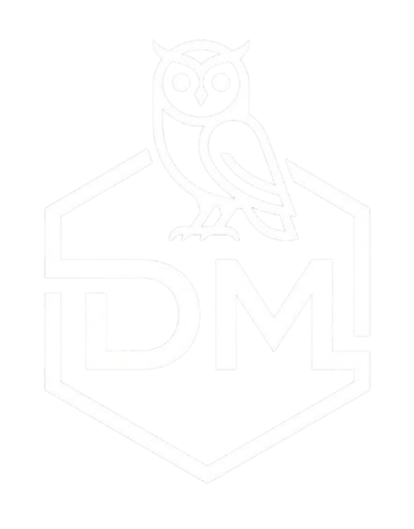

<p align="center">
  
</p>

<h1 align="center">Portafolio Web - David Luna</h1>

Portafolio personal construido con React, TypeScript y Vite, con enfoque en experiencia visual, navegación rápida y contenido profesional bilingue (ES/EN).

## Contexto actual del proyecto

El proyecto evoluciono desde una web de presentacion clasica a una experiencia interactiva con:

- Modo visual claro/tatami con cambio inmediato.
- Navegacion responsiva: sidebar en desktop + menu hamburguesa fullscreen en mobile.
- Pagina de musica inmersiva con reproductor funcional y fondo audio-reactivo.
- Atajos globales de teclado para productividad y demo.
- Contenido real actualizado (testimonios reales y CV por idioma).

## Stack tecnico

- React 18
- TypeScript
- Vite 6
- Tailwind CSS 4
- React Router 7
- motion (animaciones)
- Lucide React (iconografia)
- React Slick (carrusel de testimonios)

## Arquitectura de la aplicacion

### Estructura principal

```text
src/
  app/
    App.tsx
    routes.tsx
    components/
      Layout.tsx
      Sidebar.tsx
      Footer.tsx
      ThemeToggle.tsx
      CustomCursor.tsx
      CircularMenu.tsx
      PageShell.tsx
      TabHint.tsx
    config/
      navigation.tsx
    contexts/
      LanguageContext.tsx
      ThemeContext.tsx
    pages/
      Home.tsx
      About.tsx
      Projects.tsx
      Testimonials.tsx
      Experience.tsx
      PersonalLife.tsx
      Music.tsx
      Contact.tsx
  imports/
    CV_David_Luna.pdf
    CV_David_Luna_English.pdf
    image-0.png
    music/
  styles/
    index.css
    theme.css
    cursor.css
    slider.css
```

### Capas de arquitectura

- Capa de rutas: [src/app/routes.tsx](src/app/routes.tsx).
- Capa de layout global: [src/app/components/Layout.tsx](src/app/components/Layout.tsx).
- Capa de estado global:
  - idioma en [src/app/contexts/LanguageContext.tsx](src/app/contexts/LanguageContext.tsx)
  - tema en [src/app/contexts/ThemeContext.tsx](src/app/contexts/ThemeContext.tsx)
- Capa de paginas (features por seccion) en [src/app/pages](src/app/pages).
- Capa visual reutilizable en [src/app/components](src/app/components).

## Navegacion y rutas

Rutas principales:

- /
- /about
- /projects
- /testimonials
- /experience
- /personal
- /music
- /contact

Compatibilidad adicional:

- Se soporta tambien /Portafolio para evitar problemas con enlaces anteriores.

## Funcionalidades clave

### 1. Sistema de idioma (ES/EN)

- Toggle desde UI.
- Atajo global: Shift+E.
- Textos traducidos con helper t(es, en).

### 2. Sistema de tema

- Tema default (claro) y tatami (oscuro).
- Toggle visual flotante.
- Atajo global: Shift+Q.

### 3. Navegacion responsiva

- Desktop: sidebar lateral fija con tooltips.
- Mobile: boton hamburguesa en esquina superior izquierda.
- Overlay de menu fullscreen en mobile con enlaces a todas las paginas.

### 4. Pagina de musica inmersiva

Archivo: [src/app/pages/Music.tsx](src/app/pages/Music.tsx)

Incluye:

- Reproductor con play/pause, next/prev, volume, shuffle y repeat.
- Barra de progreso horizontal (desktop) y vertical interactiva (mobile).
- Fondo audio-reactivo usando Web Audio API (AnalyserNode).
- Modo inmersivo que oculta chrome (sidebar/footer/toggles).
- Carga de canciones locales desde carpeta mediante folder picker.
- Playlist inicial desde [src/imports/music](src/imports/music).

### 5. Testimonios reales

Archivo: [src/app/pages/Testimonials.tsx](src/app/pages/Testimonials.tsx)

- Reemplazo de testimonios simulados por testimonios reales.
- Cards con altura consistente para evitar saltos visuales.
- Carrusel desktop y flujo mobile optimizado.

### 6. Home + descarga de CV por idioma

Archivo: [src/app/pages/Home.tsx](src/app/pages/Home.tsx)

- Si idioma ES: descarga CV_David_Luna.pdf.
- Si idioma EN: descarga CV_David_Luna_English.pdf.

## Interacciones de teclado

- Shift+Q: cambiar tema (claro/tatami).
- Shift+E: cambiar idioma (ES/EN).
- Tab (desktop): abrir/cerrar menu circular.
- Escape: cerrar menu circular.

Nota: los atajos de Shift+Q y Shift+E no se disparan cuando el foco esta en campos de escritura.

## Sistema visual

Paleta base principal:

- Fondo oscuro estructural: #2C2416
- Borde principal: #8B7355
- Acento: #C4A57B
- Fondo claro: #F5F1E8

Archivos clave de estilo:

- [src/styles/theme.css](src/styles/theme.css)
- [src/styles/index.css](src/styles/index.css)
- [src/styles/cursor.css](src/styles/cursor.css)
- [src/styles/slider.css](src/styles/slider.css)

## Ejecutar en local

Instalar dependencias:

```bash
npm install
```

Modo desarrollo:

```bash
npm run dev
```

Build produccion:

```bash
npm run build
```

Preview build:

```bash
npx vite preview
```

## Estado del portafolio

El portafolio esta alineado con el contexto actual del proyecto: navegacion mobile renovada, pagina de musica inmersiva, atajos globales de teclado, testimonios reales y estructura modular mantenible.
  